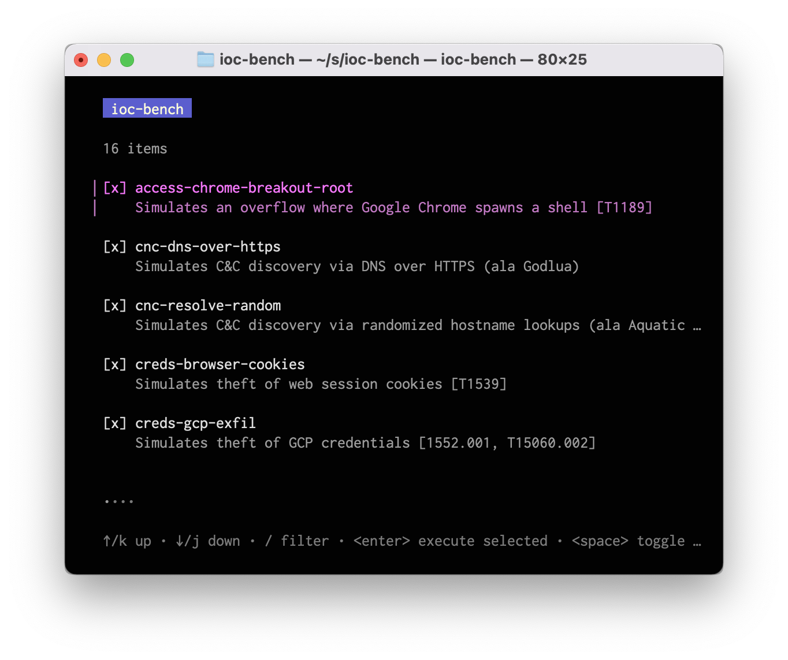
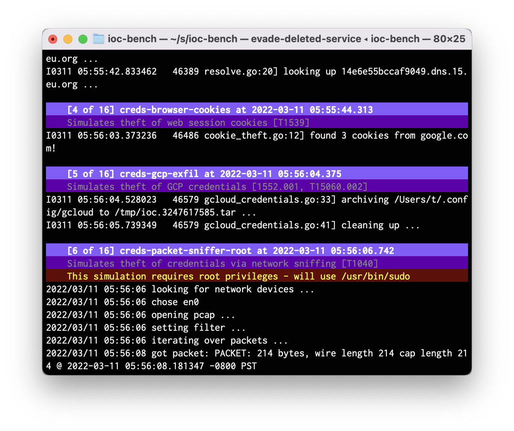

# ioc-bench


ioc-bench simulates a number of popular indicators of compromise from the MITRE ATT&CK framework, biasing toward those seen in more recent attacks.

How many of these simulations does your intrusion detection configuration detect?

## Screenshots




## Requirements

* A UNIX-like operating system
* The Go Programming language

## Usage

`go run .`

For the few checks that require root, you will be prompted for a password.

## Implemented

* access-chrome-breakout-root: Simulates an overflow where Google Chrome spawns a shell [T1189]
* cnc-dns-over-https: Simulates C&C discovery via DNS over HTTPS (ala Godlua)
* cnc-resolve-random: Simulates C&C discovery via randomized hostname lookups (ala Aquatic Panda)
* creds-browser-cookies: Simulates theft of web session cookies [T1539]
* creds-gcp-exfil: Simulates theft of GCP credentials [1552.001, T15060.002]
* creds-keylogger-root: Simulate theft of credentials via key logging [T1056]
* creds-packet-sniffer-root: Simulates theft of credentials via network sniffing [T1040]
* evade-bash-history: Simulates attack cleanup via bash_history truncation [T1070.003]
* evade-deleted-service: Simulates a service running by a binary which no longer exists
* evade-masquerade-kernel-thread: Simulates process masquerading as a kernel thread [T1036.004]
* evade-tools-in-var-tmp-hidden: Simulates tool transfer using curl & running from /var/tmp/. [T1036.005]
* evade-usr-bin-exec-root: Simulates malicious program installing itself into /usr/bin [T1036.005]
* exec-bash-reverse-shell: Launches a temporary reverse shell using bash
* exec-curl-to-hidden-url: Simulates tool transfer using curl to a hidden directory [T1036.005]
* exec-drop-eicar: Simulates droppping a known virus signature (EICAR) onto filesystem
* exec-netcat-listen: Launches netcat to listen on a port [T1059.004]
* exec-netcat-reverse-shell: Launches a temporary reverse shell using netcat
* exec-python-reverse-shell: Launches a temporary reverse shell using bash
* exec-traitor-vuln-probe: Simulates probing system for privilege escalation vulns
* persist-iptables-root: Simulates attacker making iptables changes to allow incoming traffic
* privesc-traitor-dirty-pipe: Simulate CVE-2022-0847 (Dirty pipe) to escalate user privileges to root
* privesc-traitor-docker-socket: Simulates using Docker sockets to escalate user privileges to root

```shell
for d in cmd/*; do echo "* $(echo $d | cut -d/ -f2): $(go doc ./${d})"; done
```
